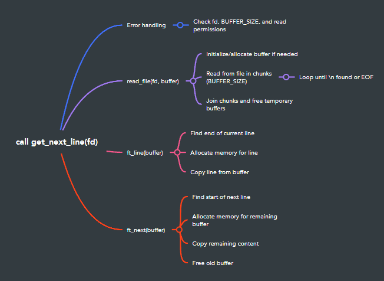

# get_next_line


A C function that reads content line by line from a file descriptor.

## 💡 About

`get_next_line` is a function that returns a line read from a file descriptor. This project is part of the 42 school curriculum and teaches us about static variables, memory allocation, and file manipulation in C.

## 🧠 Concepts Covered


- File descriptors
- Static variables
- Memory allocation and management
- Buffer manipulation
- String operations

## 🛠️ Function Description

```c
char *get_next_line(int fd);
```

### Parameters
- `fd`: The file descriptor to read from

### Return Value
- The line that was read (including the terminating `\n` if present)
- `NULL` if there is nothing else to read or if an error occurred

### Features
- Reads from multiple file descriptors simultaneously (bonus part)
- Handles various buffer sizes through the `BUFFER_SIZE` define
- Memory efficient with proper allocation and deallocation
- Handles error cases gracefully

## 🚀 Usage

### Compilation

```bash
cc -Wall -Wextra -Werror -D BUFFER_SIZE=42 get_next_line.c get_next_line_utils.c
```

### Example Usage

```c
#include "get_next_line.h"
#include <fcntl.h>
#include <stdio.h>

int main(void)
{
    int     fd;
    char    *line;

    fd = open("example.txt", O_RDONLY);
    while ((line = get_next_line(fd)) != NULL)
    {
        printf("%s", line);
        free(line);
    }
    close(fd);
    return (0);
}
```

## 📝 Implementation Details

The function uses:
- Static variables to keep track of leftover characters between function calls
- Dynamic memory allocation to handle lines of any size
- Buffer management to optimize reading operations
- Proper memory management to prevent leaks

## ⚠️ Important Notes

- Always remember to free the returned line when you're done using it
- The function handles error cases like invalid file descriptors
- The BUFFER_SIZE can be modified during compilation
- Proper memory management is crucial to avoid leaks

## 🔍 Testing

Test the function with:
- Different buffer sizes
- Multiple file descriptors
- Files of various sizes
- Edge cases (empty files, no newlines, etc.)
- Memory leak detection tools (valgrind)

## 📚 Files

- `get_next_line.c`: Main function implementation
- `get_next_line_utils.c`: Helper functions
- `get_next_line.h`: Header file with prototypes and includes
- `get_next_line_bonus.c`: Bonus implementation for multiple FDs
- `get_next_line_utils_bonus.c`: Bonus helper functions
- `get_next_line_bonus.h`: Bonus header file

---
Made with ❤️ by sgouzi